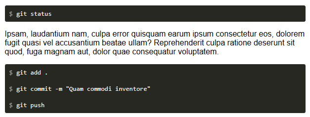
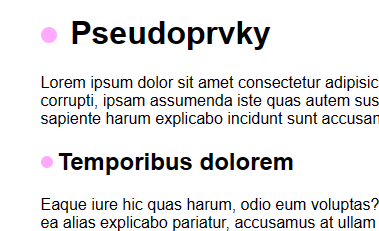
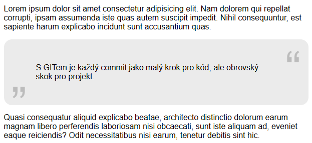

# Cvičení: Before after

## Zadání

Otevři si soubor `moje-styly.css` a doplň ho podle následujících instrukcí. V celém cvičení není potřeba upravovat žádné jiné soubory.

1. ### Kód

   Přidej prvku `code` pseudoprvek se znakem dolaru (`$`), který se obvykle používá pro znázornění příkazu pro terminál.

   

1. ### Nadpisy

   Přidej před všechny nadpisy úrovně `h1` a `h2` dekorační kolečko.

   

1. ### Citát

   Doplň do prvku `blockquote` ozdobné uvozovku `„` do levého dolního rohu a `“` do pravého horního.

   

1. ### Zpět nahoru

   Nastyluj v prvku se třídou `nahoru` šipku.

   
